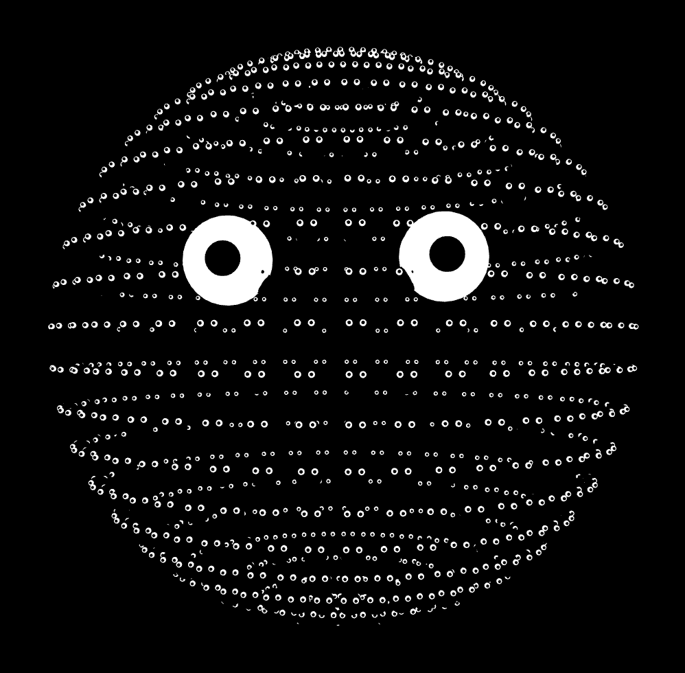
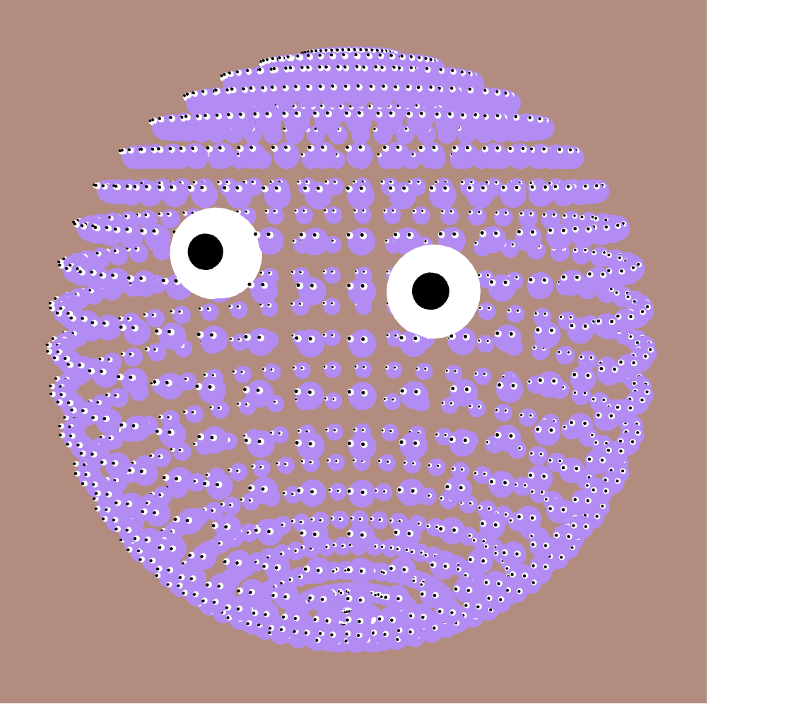

# M-Eyes Portrait

LUCAS MELDRUM

[View this project online](https://lucasmeldrum.github.io/CART253/topics/assignments/art-jam)

## Description

> *M-Eyes Portrait* is a portrait art piece filled with moving eyes and faces. The user can control the color and move around the work in the 3D space to change up their experience.

> Using a mouse, the user can left click to change the color of both the background and the spheres and give the face a pulsating effect. Furthermore, the user can explore in the 3D world by using scroll wheel and dragging around the piece.

> The project is meant to be a silly portrait in a colorful world. Starting off pitch black it gives an eerie tone with the eyes following the mouse until the user clicks and enjoys the bright colors (usually). Silly, fun and interactive!

## Screenshot(s)

## Attribution

Elements used taken from examples in p5 documentation:

> - This project uses [p5.js](https://p5js.org). Specifically, functions that I used that were not learnt in class:
-[scale](https://p5js.org/reference/p5/scale/): Used for pulsing affect 
-[normalMaterial](https://p5js.org/reference/p5/normalMaterial/): Used to change material of the spheres
-[orbitControl](https://p5js.org/reference/p5/orbitControl/): Used to be able to move around in 3D space
-[angleMode](https://p5js.org/reference/p5/angleMode/): Used to change the unit system to degrees
-[map](https://p5js.org/reference/p5/map/): Used to map the eyes to the mouse
-[rotateWithFrameCount](https://p5js.org/examples/3d-geometries/) Taken example from the bottom of the page, rotates the eyes with frames

## License

> This project is licensed under a Creative Commons Attribution ([CC BY 4.0](https://creativecommons.org/licenses/by/4.0/deed.en)) license with the exception of libraries and other components with their own licenses.